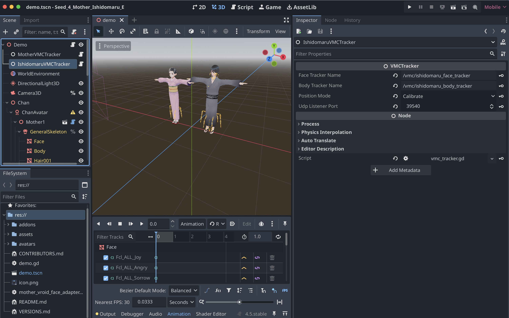

# Setting the port of avatar 1, Ishidomaru


### Set Ishidomaru’s VMC port

1. Stop the running Godot scene, if necessary.
    
2. Open `demo.tscn`.
    
3. At the top of the Scene tree, select:
    

```
Demo
└── IshidomaruVMCTracker
```

4. In the panel on the right, select **Inspector**, not **Node**.
    
5. Find the property:
    

```
UDP Listener Port
```

6. Set it to:

```
39540
```

7. In the same Inspector, verify:

```
Body Tracker Name: /vmc/ishidomaru_body_tracker
Face Tracker Name: /vmc/ishidomaru_face_tracker
```

8. Save the scene with `Command-S`.

Ishidomaru’s Godot route is now:

```
UDP 39540
    ↓
IshidomaruVMCTracker
    ↓
/vmc/ishidomaru_body_tracker
/vmc/ishidomaru_face_tracker
    ↓
Ishidomaru
```

Do not change the port on `XRBodyModifier3D`; it contains only the body tracker name, not the network port.


# Network port and body tracker name: correspondence and function

There are two different properties:

1. A network port number.
2. A body tracker name.

### Network port

The network port is a real UDP port used to receive VMC messages from `BunrakuOSCDecoder`.

For Ishidomaru:

```
UDP Listener Port: 39540
```

It belongs to the `IshidomaruVMCTracker` receiver node.

### Body tracker name

The body tracker name is an internal Godot identifier:

```
/vmc/ishidomaru_body_tracker
```

It is not a network address or port. Godot uses it to connect the VMC receiver with the nodes that animate Ishidomaru.

The receiver publishes incoming body data under that name:

```
IshidomaruVMCTracker
UDP Listener Port: 39540
Body Tracker Name: /vmc/ishidomaru_body_tracker
```

The avatar modifier subscribes to the same name:

```
XRBodyModifier3D
Body Tracker: /vmc/ishidomaru_body_tracker
```

Therefore, the complete connection is:

```
BunrakuOSCDecoder
        │
        │ VMC network packets
        ▼
UDP port 39540
        │
        ▼
IshidomaruVMCTracker
        │
        │ publishes body data internally
        ▼
/vmc/ishidomaru_body_tracker
        │
        ▼
XRBodyModifier3D
        │
        ▼
Ishidomaru skeleton
```

In short:

|Setting|Example|Function|
|---|---|---|
|UDP listener port|`39540`|Receives packets over the network|
|Body tracker name|`/vmc/ishidomaru_body_tracker`|Connects Godot nodes internally|
|Face tracker name|`/vmc/ishidomaru_face_tracker`|Connects facial data internally|

So when setting an avatar’s destination from Bmc, use the actual network port:

```
Bmc.avatar(\Ishidomaru).vmcPort_(39540);
```

Do not put `39540` into `XRBodyModifier3D`. Its **Body Tracker** field must contain the tracker name.


### Set the VMC port numbers for Mother and Ishidomaru

At the top of the `Demo` scene tree, there are two explicit VMC receiver nodes:

```text
Demo
├── MotherVMCTracker
└── IshidomaruVMCTracker
```

Configure each receiver separately:

1. Select `MotherVMCTracker` in the Scene tree.
2. Open the **Inspector** panel.
3. Set **UDP Listener Port** to `39539`.
4. Verify:

```text
Body Tracker Name: /vmc/mother_body_tracker
Face Tracker Name: /vmc/mother_face_tracker
```

5. Select `IshidomaruVMCTracker`.
6. Set **UDP Listener Port** to `39540`.
7. Verify:

```text
Body Tracker Name: /vmc/ishidomaru_body_tracker
Face Tracker Name: /vmc/ishidomaru_face_tracker
```

8. Save `demo.tscn` with `Command-S`.



The corresponding Bmc destination ports must match:

```supercollider
Bmc.avatar(\Mother).vmcPort_(39539);
Bmc.avatar(\Ishidomaru).vmcPort_(39540);
```

> [!WARNING]
> In project E, do not re-enable the Godot VMC Tracker editor plugin. Enabling it automatically recreates the global `VmcPlugin` autoload, which may attempt to listen on port `39539` and conflict with the explicit `MotherVMCTracker`. The runtime VMC scripts remain available to both explicit receiver nodes even though this editor plugin is disabled.
