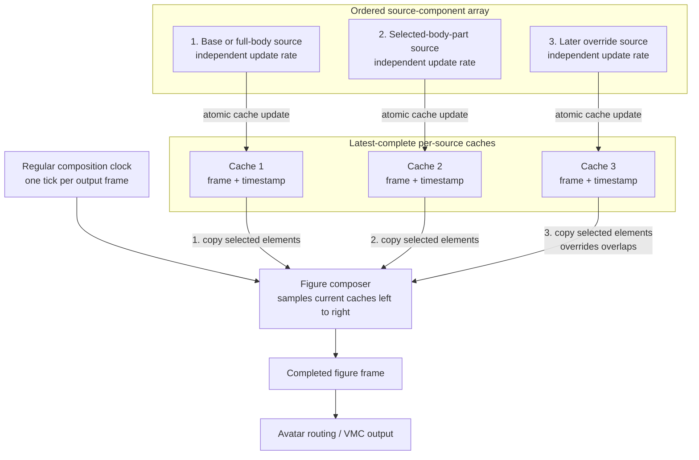

# Glossary, basic concepts

**Motion source**
: Anything capable of supplying time-varying motion data. A source may be a recorded clip, a live mocap stream, a language-side function, a Synth-controlled generator, or another compatible producer. A motion source is independent of the avatar that may eventually render its data.

**Motion**
: A configured use of a motion source. Its configuration may specify playback rate, looping, starting position, transformations, and other processing rules. Several motions may use the same underlying source differently.

**Figure**
: A logical moving body whose complete frames are composed from one or more ordered source components. A figure exists before avatar routing: it describes the resulting motion, not the rendered model or its VMC destination.

**Figure construction / figure composition**
: The process of assembling a figure's complete frame from its ordered source components. *Figure composition* is the preferred term for the runtime process; *figure construction* may also refer more broadly to defining the component array, selections, and missing-data rules that the process will use.

**Source component**
: One entry in a figure's ordered source-component array. It identifies a motion and specifies which elements that motion may contribute, together with any component-level transformations or rules. A component is therefore a configured layer in a particular figure, not the underlying motion data itself.

**Source-component array**
: The ordered collection of components used to compose a figure. Components are applied from left to right. Array order defines precedence: for an element selected by more than one component, the later component's valid value replaces the earlier value.

**Element**
: A separately composable part of motion data, such as a root transform, bone position, bone rotation, hand channel, or facial-expression value. The precise element vocabulary is defined by BuMoChi's frame representation.

**Selection / component mask**
: The set of elements that a source component is allowed to copy into the composition frame. Values outside the selection have no effect. Missing values inside the selection must not erase valid values inherited from an earlier component.

**Source cache**
: A source component's latest completely computed frame or partial frame, retained together with timing information. The composer reads this stable snapshot rather than reading values while the source is still changing them.

**Atomic cache update**
: Publication of a newly computed source frame as one complete operation. Until publication is complete, the composer continues to see the preceding cached frame and can never observe a mixture of old and new values.

**Update rate**
: The frequency at which an individual motion source computes and publishes new cached values. Different sources may have different or irregular update rates. Update rate is distinct from the figure's composition rate.

**Composition clock**
: The single regular clock that tells the figure composer when to sample all source caches and produce another complete frame.

**Composition rate**
: The frequency of composition-clock ticks and therefore the nominal rate at which complete figure frames are generated. It should normally be at least as high as the intended animation/VMC output rate.

**Composition tick / sampling instant**
: One event of the composition clock. At that instant, the composer reads the latest complete cache of every component and applies the components from left to right.

**Composition frame**
: The temporary working frame assembled during a composition tick. It begins with a defined base or neutral state and is progressively filled or overridden by the ordered source components.

**Output frame / completed figure frame**
: The stable result published after every source component has been applied and any still-missing values have been resolved. Only after completion is routing information added and the frame sent to an avatar destination.

**Sample and hold**
: The timing rule used when a source has not published a new value before a composition tick. The composer reuses that source's most recent cached value until a replacement becomes available.

**Timestamp and sequence number**
: Metadata recording when a cached value was produced and, optionally, its order within the source stream. These fields support diagnostics and may later support interpolation, resampling, and stale-source detection.

**Avatar**
: The external rendered destination assigned to a completed figure. The avatar provides its identity and final VMC route; it does not determine the contents or ownership of the source clips and motions used to compose the figure.

# Data composition order

The motion sources used to construct a figure are stored in an ordered array of source components. The array expresses precedence as well as membership. At each composition step, the components are evaluated from left to right. Each component may contribute only its intended elements—for example, the root, torso, arms, hands, face, or selected individual bones. A value written by a later component therefore replaces an earlier value for the same element, while elements that it does not target retain the values already supplied by earlier components.

Each source may update its cache several times, once, or not at all between two composition ticks. At a tick, the composer reads the latest complete value in each cache. A cache with no new value therefore contributes its previous value.

## Per-source caches

Each source component computes independently and writes its most recent complete or partial frame into its own cache. A component must finish updating its cache before that cache becomes visible to the composer; the composer should never read a half-written frame. The cache should also retain the source timestamp and, where useful, a local sequence number.

The components should not copy their data directly into one another. Instead, the figure composer owns a temporary composition frame. On each composition step it reads the current cache of every component, in array order, and selectively copies the elements enabled by that component's mask into the temporary frame. This keeps source computation separate from composition and makes left-to-right precedence explicit.

If a slow component has not produced a new value when the next composition step begins, its last cached value is reused. This is a sample-and-hold rule: a source remains effective until it publishes a replacement. A faster component may update its cache several times between two composition steps; the next step reads the newest complete value available at that instant.

## Composition clock

The complete figure should be assembled and emitted on one regular composition clock rather than whenever any individual source happens to update. At every tick, the composer performs the following operations:

1. Start with an empty frame or a defined neutral/base frame.
2. Read each component's latest complete cached frame from left to right.
3. Copy only the elements selected by that component into the composition frame.
4. Allow later components to replace earlier values for elements selected by both.
5. Publish the completed figure frame to the avatar/output stage.

This gives the output a stable frame rate and makes recordings and network transmission deterministic even when clip routines, live streams, functions, and Synth-controlled generators update at different rates.

A regular composition clock cannot preserve every intermediate value generated by a source that runs faster than that clock. It preserves the source's state at each sampling instant. The clock should therefore be fast enough for the desired motion detail—normally at least the intended Godot/VMC output frame rate. If exact preservation of every source event later becomes necessary, components can retain a short timestamped history and the composer can interpolate or resample it. That is a separate refinement; the initial implementation should use latest-complete caches and a single regular composition clock because its timing and precedence are clear and predictable.
