# Purpose

This document explains how motion-capture sources become completed avatar motion on two collaborating BuMoChi workstations. It describes signal meaning and ownership rather than application startup commands. For the complete launch procedure, see [Multi User With OSCGroups Setup](MultiUserWithOscGroupsSetup.md).

# Core principle: distributed sources, local synthesis

Collaborating workstations exchange motion-source frames, not finished avatar animation. Each workstation receives its own local source directly and receives the other performers' sources through OSCGroups. Its local SuperCollider/Bmc process then evaluates the same session definition, constructs all figures, assigns the completed figures to avatars, and sends the complete scene to its own Godot renderer.

Consequently, Workstation A and Workstation B receive the same source material and independently synthesize the same intended animation. The OSCGroups network carries route-free version-1 source frames. Routed version-2 completed figure frames, decoder output, and Godot VMC data remain local to each workstation.

# Complete two-workstation signal flow

```mermaid
flowchart LR
    subgraph A["Workstation A"]
        direction TB
        XRA["XR-Animator A<br/>local PerformerA mocap"]
        EncA["BunrakuOSCEncoder A<br/>avatar: PerformerA<br/>source: workstation-a-xr-animator"]
        ClientA["OscGroupClient A<br/>input port 22244<br/>output port 57130"]
        BmcA["SuperCollider / Bmc A<br/>receives PerformerA + PerformerB<br/>constructs both figures locally"]
        DecA["BunrakuOSCDecoder A<br/>input 39538<br/>reads frame-embedded port nr"]
        GodotA["Godot A<br/>Ishidomaru: VMC 39539<br/>Mother: VMC 39540"]

        XRA -->|"VMC 39537"| EncA
        EncA -->|"local route-free PerformerA<br/>UDP 57130"| BmcA
        EncA -->|"identical network copy<br/>UDP 22244"| ClientA
        ClientA -->|"remote route-free PerformerB<br/>UDP 57130"| BmcA
        BmcA -->|"completed figures with embedded ports<br/>UDP 39538"| DecA
        DecA -->|"local VMC 39539 and 39540"| GodotA
    end

    subgraph N["OSCGroups network"]
        Server["OscGroupServer<br/>shared group<br/>server port 22242"]
    end

    subgraph B["Workstation B"]
        direction TB
        XRB["XR-Animator B<br/>local PerformerB mocap"]
        EncB["BunrakuOSCEncoder B<br/>avatar: PerformerB<br/>source: workstation-b-xr-animator"]
        ClientB["OscGroupClient B<br/>input port 22244<br/>output port 57130"]
        BmcB["SuperCollider / Bmc B<br/>receives PerformerA + PerformerB<br/>constructs both figures locally"]
        DecB["BunrakuOSCDecoder B<br/>input 39538<br/>reads frame-embedded port nr"]
        GodotB["Godot B<br/>Ishidomaru: VMC 39539<br/>Mother: VMC 39540"]

        XRB -->|"VMC 39537"| EncB
        EncB -->|"local route-free PerformerB<br/>UDP 57130"| BmcB
        EncB -->|"identical network copy<br/>UDP 22244"| ClientB
        ClientB -->|"remote route-free PerformerA<br/>UDP 57130"| BmcB
        BmcB -->|"completed figures with embedded ports<br/>UDP 39538"| DecB
        DecB -->|"local VMC 39539 and 39540"| GodotB
    end

    ClientA -->|"send PerformerA"| Server
    Server -->|"deliver PerformerA"| ClientB
    ClientB -->|"send PerformerB"| Server
    Server -->|"deliver PerformerB"| ClientA

    classDef source fill:#dceeff,stroke:#222,stroke-width:2px;
    classDef encoder fill:#ffe4c4,stroke:#222,stroke-width:2px;
    classDef synthesis fill:#fff3bf,stroke:#222,stroke-width:2px;
    classDef network fill:#e9ddf7,stroke:#c22,stroke-width:2px;
    classDef render fill:#ddf3df,stroke:#222,stroke-width:2px;
    class XRA,XRB source;
    class EncA,EncB,DecA,DecB encoder;
    class BmcA,BmcB synthesis;
    class ClientA,ClientB,Server network;
    class GodotA,GodotB render;
```

# What happens to one source frame

1. XR-Animator A sends one VMC pose to Encoder A on local port `39537`.
2. Encoder A converts the pose into a route-free Bunraku version-1 frame carrying the stable source identities `PerformerA` and `workstation-a-xr-animator`.
3. Encoder A sends identical copies to local Bmc on `57130` and local `OscGroupClient` input port `22244`.
4. The server forwards the network copy to Client B. It normally does not echo that frame to Client A because Bmc A already received its direct local copy.
5. Client B delivers the remote `PerformerA` frame to Bmc B on `57130`.
6. Bmc A and Bmc B now both possess the latest `PerformerA` source data. The same process occurs in the opposite direction for `PerformerB`.
7. Each Bmc independently applies its local session, motion, and figure-composition rules to the two sources and produces completed figure frames.
8. At the figure-to-avatar boundary, Bmc assigns the final avatar identity and embeds the intended Godot VMC destination port.
9. Each Bmc sends its routed completed frames to its own decoder on `39538`. Each decoder reconstructs VMC and forwards it only to its local Godot receivers.

# Source identity, figure identity, and avatar identity

The source identity describes where motion data came from. It must remain stable and unique across the collaboration so that every Bmc can distinguish `PerformerA` from `PerformerB` even though both arrive on port `57130`.

A figure is the locally composed logical body. It may use one source, combine several sources, or selectively layer body parts from different motions. Figure construction is performed independently on every workstation according to the shared session definition.

An avatar is the final rendered destination of a completed figure. The avatar assignment determines the outgoing identity and VMC port, but it does not change or become stored in the underlying source clip. In this example the completed Ishidomaru figure is routed to `39539` and the completed Mother figure is routed to `39540` on both workstations.

# Settings that must agree

Both workstations must use the same session/composition definition, source-name expectations, figure construction rules, avatar assignments, Godot scene, and avatar-to-port map. They may reuse the same local UDP port numbers because the ports belong to different computers. OSCGroups usernames and encoder source identities must remain unique.

| Meaning | Workstation A | Workstation B |
|---|---|---|
| Local performer source | `PerformerA` | `PerformerB` |
| Remote performer source | `PerformerB` | `PerformerA` |
| Bmc input | `57130` | `57130` |
| OscGroupClient input/output | `22244` / `57130` | `22244` / `57130` |
| Local decoder input | `39538` | `39538` |
| Ishidomaru VMC destination | `39539` | `39539` |
| Mother VMC destination | `39540` | `39540` |

# Timing and visual agreement

The two renderers synthesize the same defined scene, but they are not guaranteed to display every frame at precisely the same wall-clock instant. Network latency, jitter, source update rates, and local scheduling may produce small temporal differences. Source caches and a regular local figure-composition clock provide deterministic ordering and stable local output; explicit clock synchronization or timestamp-aware resampling would be a later refinement if tighter cross-site visual synchronization is required.

# Paths that must not be created

- Do not send Bmc's completed routed frames to OSCGroups.
- Do not send decoder output or Godot VMC output back to OSCGroups.
- Do not set an `OscGroupClient` output to its own input port `22244`.
- Do not send remote source frames directly to the decoder, because this bypasses Bmc's local figure synthesis.
- Do not run two clients with the same OSCGroups username.

# Related guides

- [Multi User With OSCGroups Setup](MultiUserWithOscGroupsSetup.md)
- [OscGroupClient Use and Configuration](../OSCGroupsUseAndConfiguration.md)
- [OSC Encoder and Decoder Use and Configuration](../OSCEncoder-DecoderUseAndConfiguration.md)
- [Avatar Port Numbers](../Avatar_Port_Numbers.md)
- [Port Number Specification](../PortNumberSpecification.md)
