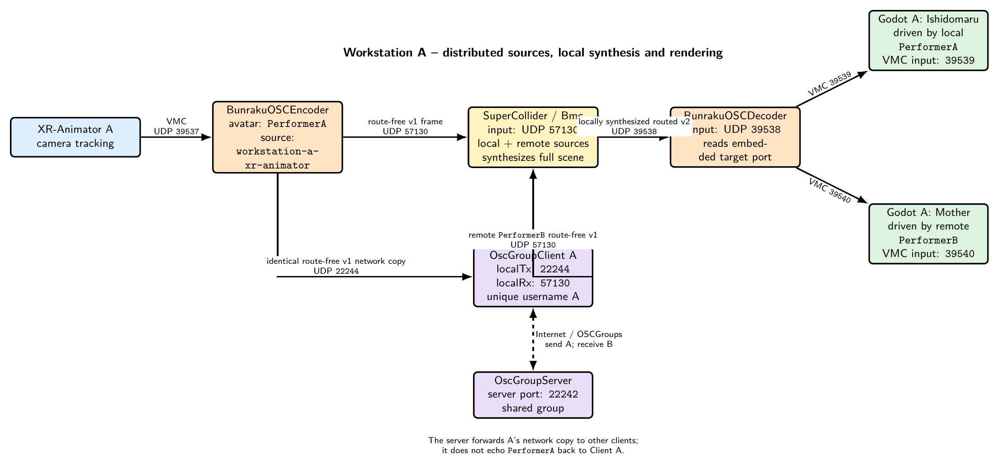
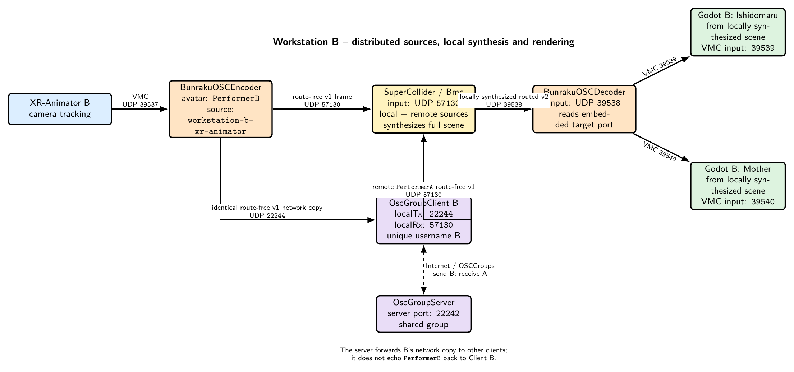

#+title: Multi User With OSCGroups Setup

This is the canonical collaborative setup. It follows BuMoChi's *distributed sources, local synthesis* model: OSCGroups distributes route-free motion-source frames; every workstation's SuperCollider/BuMoChi process receives all sources, independently constructs the complete animation scene, and sends the finished local result to its own decoder and Godot renderer.

* Operational model

Every workstation's Bmc receives two kinds of input on port =57130=:

1. its own encoder's local source-frame copy;
2. remote source frames delivered by its =OscGroupClient=.

The local encoder also sends an identical route-free copy to =OscGroupClient= transmit port =22244=. Bmc never sends processed output to OSCGroups. After combining, filtering, layering, and assigning motions to figures and avatars, Bmc sends routed version-2 frames only to its local decoder on =39538=. The decoder reconstructs VMC for local Godot.

This is analogous to networked sound synthesis in sc-hacks-redux: collaborators share source material, while every workstation performs the full synthesis locally.

* One client per workstation

One full-duplex =OscGroupClient= handles both network directions:

#+begin_example
local encoder -> client localTxPort -> OSCGroups network
OSCGroups network -> client localRxPort -> local Bmc
#+end_example

Do not start separate sending and receiving clients on an ordinary workstation.

* Shared-scene rule

All workstations should load the same Bmc session/composition and run the same Godot scene, including the same avatar-to-VMC-port assignments:

| Source stream | Completed avatar | Godot character | VMC port |
|---------------+------------------+-----------------+----------|
| =PerformerA=  | =Ishidomaru=     | Ishidomaru      |    39539 |
| =PerformerB=  | =Mother=         | Mother          |    39540 |

Both Bmc instances receive both source streams and synthesize both completed avatars locally. Both Godot instances therefore render the same defined scene. Network latency can cause small timing differences.

The OSCGroups server normally does not echo a workstation's own message back. This is expected: the encoder supplies its local Bmc copy directly.

* Signal path on every workstation

#+begin_example
local XR-Animator
    -> VMC 127.0.0.1:39537
local BunrakuOSCEncoder
    -> route-free v1 127.0.0.1:57130 (local Bmc)
    -> identical route-free v1 127.0.0.1:22244 (OscGroupClient)
one local OscGroupClient
    -> OSCGroups server and remote collaborators
remote route-free v1 frames
    -> same local OscGroupClient
    -> 127.0.0.1:57130 (local Bmc)
local Bmc
    -> synthesizes the complete scene from local and remote sources
    -> routed v2 frames 127.0.0.1:39538 (local decoder only)
one local BunrakuOSCDecoder
    -> local Godot VMC ports 39539, 39540, ...
#+end_example

Only route-free source frames cross the network. Clips, motions, figures, avatar assignments, final routing, decoding, and rendering remain local.

* Complete workstation pipelines

The diagrams show two workstations. Both synthesize the same scene: Ishidomaru listens on =39539= and Mother on =39540=.

** Workstation A

#+CAPTION: Workstation A shares PerformerA source frames, receives PerformerB source frames, and synthesizes the complete scene locally.
#+ATTR_HTML: :width 100%
#+ATTR_LATEX: :width 1.0\linewidth

** Workstation B

#+CAPTION: Workstation B shares PerformerB source frames, receives PerformerA source frames, and synthesizes the same complete scene locally.
#+ATTR_HTML: :width 100%
#+ATTR_LATEX: :width 1.0\linewidth

* Shared and unique settings

All collaborators must agree on the OSCGroups server, group credentials, stable source identities, Bmc session/composition, Godot scene, and avatar-to-port map. Every workstation needs a unique OSCGroups username and normally a unique =localToRemotePort=. Local application ports may use the same numbers on different computers.

* Port map on each workstation

| Port  | Listener                        | Sender                                |
|-------+---------------------------------+---------------------------------------|
| 39537 | local =BunrakuOSCEncoder=       | local XR-Animator                     |
| 57130 | local Bmc/SuperCollider         | local encoder and =OscGroupClient= rx |
| 22244 | local =OscGroupClient= tx input | local encoder                         |
| 39538 | local shared decoder            | local Bmc synthesized outputs         |
| 39539 | first local Godot VMC receiver  | local decoder                         |
| 39540 | second local Godot VMC receiver | local decoder                         |

* Startup procedure

** 1. Start Godot

Run the agreed scene. In this example Ishidomaru listens on =39539= and Mother on =39540=.

** 2. Start the local decoder

#+begin_src sh
BunrakuOSCDecoder \
  --listen-port 39538 \
  --allow-target-port 39539 \
  --allow-target-port 39540 \
  --verbose
#+end_src

The allow-list is optional.

** 3. Configure and start Bmc

Both workstations load the same session/composition. Minimal routing:

#+begin_src supercollider
(
Bmc.reset;
Bmc.addAvatar(\Ishidomaru, "Ishidomaru");
Bmc.avatar(\Ishidomaru).vmcPort_(39539);
Bmc.addAvatar(\Mother, "Mother");
Bmc.avatar(\Mother).vmcPort_(39540);
Bmc.decoderPort_(39538);   // default
Bmc.forwardDecoder_(true); // false disables local renderer output
Bmc.start(57130);
)
#+end_src

=Bmc.reset= restores decoder port =39538= and enables decoder forwarding.

** 4. Start one OscGroupClient

#+begin_src sh
AppsAndCode/OSCGroups/bin/macos/OscGroupClient \
  SERVER_ADDRESS 22242 LOCAL_TO_REMOTE_PORT 22244 57130 \
  USER_NAME USER_PASSWORD GROUP_NAME GROUP_PASSWORD
#+end_src

=22244= is =localTxPort= and =57130= is =localRxPort=. Remote route-free frames enter the same Bmc input as local frames.

** 5. Start the local encoder

Workstation A:

#+begin_src sh
BunrakuOSCEncoder \
  --avatar "PerformerA" \
  --source "workstation-a-xr-animator" \
  --verbose
#+end_src

Workstation B uses =PerformerB= and =workstation-b-xr-animator=. Encoder defaults are local Bmc =57130= and local =OscGroupClient= =22244=.

Optional controls:

#+begin_src sh
--bmc-ip 127.0.0.1 --bmc-port 57130
--oscgroups-ip 127.0.0.1 --oscgroups-port 22244
--no-bmc        # network-only diagnostic mode
--no-oscgroups  # local-only mode
#+end_src

At least one output must remain enabled.

** 6. Enable XR-Animator

Set its VMC destination to =127.0.0.1:39537=.

* Verify

1. Each encoder's =received=, =sent=, =bmc_sent=, and =oscgroups_sent= counts increase.
2. Each Bmc runs on =57130= and receives both source identities.
3. Each client registers successfully.
4. Each local decoder receives only locally synthesized routed frames from Bmc on =39538=.
5. Ishidomaru moves on =39539= and Mother on =39540= in both Godot scenes.

* Avoid feedback and identity errors

- Give each encoder a unique =--avatar= and =--source= pair.
- Send only encoder-produced route-free source frames to =22244=.
- Never send Bmc routed output, decoder output, or Godot VMC output to OSCGroups.
- Keep client =localTxPort= =22244= and =localRxPort= =57130= distinct.
- Never set =localRxPort= to =22244=, which creates a loop.
- Never set =localRxPort= to =39538=, which bypasses local synthesis.
- Do not expect the server to echo local frames; the encoder provides the local copy.

* Diagnose ports

#+begin_src sh
lsof -nP -iUDP:39537
lsof -nP -iUDP:57130
lsof -nP -iUDP:22244
lsof -nP -iUDP:39538
#+end_src

* Shutdown

Disable XR-Animator, evaluate =Bmc.stop=, stop the encoder/client/decoder with =Control-C=, and stop Godot.

* Related detail

- [[file:../OSCGroupsUseAndConfiguration.org][OscGroupClient Use and Configuration]]
- [[file:../OSCEncoder-DecoderUseAndConfiguration.org][OSC Encoder and Decoder Use and Configuration]]
- [[file:../Avatar_Port_Numbers.org][Avatar Port Numbers]]
- [[file:../PortNumberSpecification.org][Port Number Specification]]
