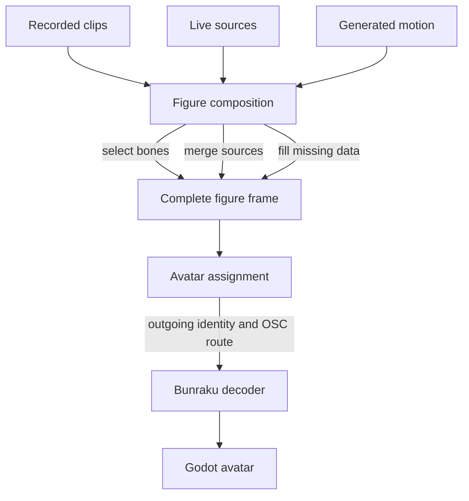

# BuMoChi Terminology

This document defines the principal terms used when recording, composing, and replaying motion with BuMoChi. It is intended to grow as the library develops.

## Clip

A clip is time-indexed mocap data: an ordered collection of frames and their
relative playback times.

A clip is not owned by, or permanently associated with, an avatar. The avatar and source names found in a recorded frame describe the provenance of the recording. They are secondary metadata: where the motion came from, rather than where it must be sent during playback.

The same clip may therefore:

- animate different avatars;
- supply only selected bones;
- be combined with other clips;
- be combined with live tracking or generated motion.

## Source

A source is anything that supplies motion data to a figure. A source may be a recorded clip, live XR-Animator or VMC stream, another networked performer, generated motion, or a previously composed figure stream.

A source may provide a complete pose or only a selected part of the body.

## Figure

A figure is a logical full-body motion state assembled from one or more
sources. It exists between raw motion sources and the rendered avatar.

A figure is responsible for motion composition, including:

- selecting bones or body regions from a source;
- merging data from several clips or live streams;
- filling missing bones from its previous or reference pose;
- producing one complete outgoing frame.

A figure is not necessarily identical to a visible avatar. The same figure could be routed to different avatars, and several figures could reuse the same clip source.

## Avatar

An avatar is the rendered destination of a completed figure. Its settings describe the external identity and network route used at the final output boundary.

An avatar normally supplies:

- the outgoing avatar name embedded in the transmitted frame;
- the destination host;
- the destination UDP port;
- eventually, renderer- or model-specific settings.

Assigning a figure to an avatar may rewrite the outgoing frame's avatar name. This happens only at the final Figure → Avatar boundary. It does not modify the source clip or imply that the clip belongs to that avatar.

## Recorded avatar name

The avatar name stored inside a recorded clip is provenance metadata. It can identify or filter the original recording source, but it does not determine the clip's future playback target.

## Clip key

A clip key is a session-local name for a clip used as a playback source. It may be the same as the saved clip name, but it does not have to be.

For example, the clip key `motherEntrance` may refer to the saved clip `take1`.
The clip key describes that clip's function within this session, while the
saved clip keeps its original name and recorded data unchanged.

## Session

A session is a named collection of reusable clip settings, figure composition settings, and avatar output routes. Session data is configuration; the motion frames remain in separate `.bmc` clip archives.

A session keeps three concerns separate:

1. `clips`: reusable motion sources and their transport settings;
2. `figures`: composition instructions and final avatar assignment;
3. `avatars`: external identities and OSC destinations.

## Conceptual pipeline



## Class responsibility

The intended long-term division of responsibility is:

| Class | Responsibility |
|---|---|
| `BmcFigure` | Reference and current poses, source selection, bone merging, and missing-data completion |
| `BmcAvatar` | External avatar name, destination host and port, and final frame transmission |

The current `BmcAvatar` implementation still performs some figure-like pose
completion and wire composition. This is an implementation stage, not the
final conceptual definition of an avatar.

## Proposed session data

```supercollider
(
    name: \duet_rehearsal,

    clips: IdentityDictionary[
        \walk -> (
            clip: \take1,
            rate: 1.0,
            loop: false,
            start: 0.0
        ),
        \arms -> (
            clip: \take2,
            rate: 1.0,
            loop: false,
            start: 0.0
        )
    ],

    figures: IdentityDictionary[
        \motherFigure -> (
            sources: [
                (clip: \walk, bones: \all),
                (clip: \arms, bones: \arms)
            ],
            avatar: \Mother
        ),
        \ishidomaruFigure -> (
            sources: [(clip: \walk, bones: \all)],
            avatar: \Ishidomaru
        )
    ],

    avatars: IdentityDictionary[
        \Mother -> (host: "127.0.0.1", port: 39537),
        \Ishidomaru -> (host: "127.0.0.1", port: 39541)
    ]
)
```
